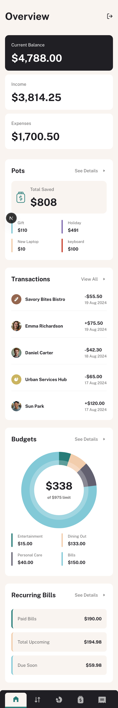
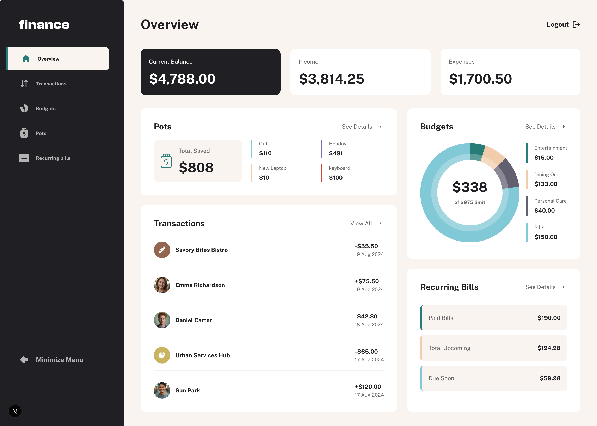

# Frontend Mentor - Personal finance app solution

This is a solution to the [Personal finance app challenge on Frontend Mentor](https://www.frontendmentor.io/challenges/personal-finance-app-JfjtZgyMt1). Frontend Mentor challenges help you improve your coding skills by building realistic projects.

## Table of contents

- [Overview](#overview)
  - [The challenge](#the-challenge)
  - [Screenshot](#screenshot)
  - [Links](#links)
- [My process](#my-process)
  - [Built with](#built-with)
  - [What I learned](#what-i-learned)
- [Author](#author)

## Overview

### The challenge

Users should be able to:

- See all of the personal finance app data at-a-glance on the overview page
- View all transactions on the transactions page with pagination for every ten transactions
- Search, sort, and filter transactions
- Create, read, update, delete (CRUD) budgets and saving pots
- View the latest three transactions for each budget category created
- View progress towards each pot
- Add money to and withdraw money from pots
- View recurring bills and the status of each for the current month
- Search and sort recurring bills
- Receive validation messages if required form fields aren't completed
- Navigate the whole app and perform all actions using only their keyboard
- View the optimal layout for the interface depending on their device's screen size
- See hover and focus states for all interactive elements on the page
- **Bonus**: Save details to a database (build the project as a full-stack app)
- **Bonus**: Create an account and log in (add user authentication to the full-stack app)

### Screenshot

### Links

- [GitHub Repository](https://github.com/maziarja/kanban-task-management)
- [Live Demo](https://kanban-task-management-sigma-umber.vercel.app/)

## My process

I began the project by deciding on the technology stack. Since the challenge included bonus requirements for building it as a full-stack app, I chose Next.js with MongoDB to provide both scalability and persistence.

The first step was implementing authentication. Once a user signs up or logs in, they receive their own set of initial data, which they can then customize and adjust based on their needs.

On the frontend, I focused on building a fully responsive UI that adapts seamlessly across all breakpoints. While reviewing the Figma design, I noticed that certain features like “Show Sidebar” and “Logout” buttons were missing, so I added them myself to improve usability.

To enhance the user experience, I also included skeleton loaders for loading states, making the interface feel smoother and more user-friendly.

### Built with

- [Next.js](https://nextjs.org/) – React framework for building the frontend and backend
- [TypeScript](https://www.typescriptlang.org/) – For type safety and maintainability
- [MongoDB](https://www.mongodb.com/) – Database for persistence
- [Mongoose](https://mongoosejs.com/) – ODM for MongoDB
- [Tailwind CSS](https://tailwindcss.com/) – Utility-first CSS framework for styling

### What I learned

In this project, I learned how to build a donut pie chart using CSS conic-gradient as a background. This approach allowed me to create clean, visually appealing charts without relying on external libraries.

## Author

- Frontend Mentor - [@maziarja](https://www.frontendmentor.io/profile/maziarja)
- Twitter - [@maz_alem](https://x.com/maz_alem)
- LinkedIn - [@maziar-jamalialem](https://www.linkedin.com/in/maziar-jamalialem-677030345/)
